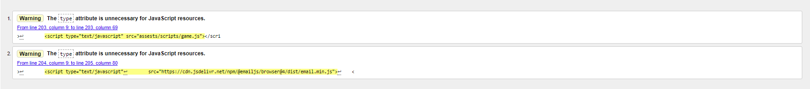

# Testing
## Test Environment
Automation testing will be done use the jest frame. The project was enabled to use jest using the following steps:
1. Initialise environment using Node Package Manager (npm)
    - In the project directory, run the command 'npm init'
    - Leave all fields as defaults expect 'test command' which should be set as jest
2. Install jest
    - In the project directory, run the command 'npm --save-dev jest'

To run the automation test suite a developer should:
1. In terminal, go to project directory
2. Run the command 'npm test'

## Automation Testing
The goal of automation testing on this project will be to capture regression in the code base. after each milestone of funcitoailty unit test will be run to ensure all test passed. If a test fails, it will be address before moving on to new funcitonailty. This will create a stable development enviroment to continue work whilst minimising the risk of regression in the code base.

## Manual testing
The goal on manual testing on this project will be to cover any missed use cases of the app not covered by unit test and to identify any use cases which need to be covered by unit tests. 

## Development Testing
This section of this document will capture all bugs and their fixes found during the development cycle. Bugs found were captured via both manual and automation testing process.

|Bug|Area|Fix|
|---|---|---|
|Settings button would not allign to right hand size of screen [image of bug](assests/imgs/readmeimgs/bug-settings-button.png)|UI|Applied justify-content: space-between; to header row. Id for header road created and css styling added.|
|Adding margin to player buttons cause bootsrapt offset class to be overwirtten.|UI|Spacer div added to replace ofset. Spacer div given display none when on smaller device screens as button do not need to be centered. |
|New game button not centering|UI|New game button was not centering when margin set to '0 auto'. Diplsay property of new game button updated to block.|
|Footer does not stick to bottom of page.|UI|Body element had bootstrap classes added which create a flex coloum equal to the 100% of the veiw port. Foot then has margin-top set to auto which push the footer to the bottom of the page. Credits refernece No. 2|
|When on smaller resolutions logo wraps on a new line|UI|Increased default bootstrap column allowment from 2 to 10|
|When on smaller resoultions buttons retain corner with increased border radious which looks odd|UI|Added media query which set all border radius to player buttons to 15px.|
|Weh on smaller resolutions score and new game button has unnesscary space between player buttons, footer, and themselevs |UI|Added score and number buttons to media query to reduce top margin and increase width when below bootsrapt medimum breakponit|
|When on smaller resoultions player button icons over spill from button|UI|Added font-size to medimum media query to reduce font size to 50px form 70px|
|When on smaller resolutions setting button wraps onto new line|UI|Logo display set to none of xs resoltuion and lower. Decrease bootstrap column assignment, for logo and title, from 10 to 6|
|Player able to start a new turn during game at nay time by pressing new game button|bug|Added line to remove onclick attribute after first call of new turn. onclick attribute set back to newTurn during game over clean up.|
|During show current sequence all buttons part of current sequence light at the same time|bug|Issue caused by incorrect use of timeout function. Code refactor to split function into two. func 1 handles the adding and removing of the light class using the itmeout funciton. func 2 loop thourgh current sequence using set interval function. Loop calls func 1. this solves the bug does create a dependency where set interval time param must be longer than the time param used in the timeout function used in func 1.|
|Clicking on button sometimes result in a split error from player button event listener|bug| This was caused when a user click on the button icon instead of button itself. Logic added to handle error in event listener function. this logic check for an error when splitting ID of element target by user. If error get ID of parent element, the button, instead and continue.|
|Clicking on a button once cause multiple calls to event listner function|bug|This was cause by the event listner being added during a loop so multiple listner were added to a single element. To solve this failure mode events listners moves out of loop into and into a function trigger when document loaded|
|Score does not update on game over|bug|Although score was reset to zero on game object update score was never call so score was never updated in the DOM|
|Player able to click player button during showing off turns causing game logic to break|bug|the issue here was created by the setting of 'isComputerTurn' being placed in the new turn function after show sequence. Show sequence operates async so isComputerturn was set to false immediately allowing users to click buttons. To solve this the setting of false to computer turn was moved to the show sequence function at the ponit set interval is clear menaing the setting of false happens at the same time as the player turn starts|
|completeing email form takes user to unstyled 405 page|bug|the use of method post attributes on the form caused 405 errors. To fix this rather than using the inbuilt onsubmit attribute an event listener was added to the form for the submit event and perform the same funcitonailty|
|email not recievced after adding event listner|bug|due to change in submit event handling form details where no longer passed to emailShare func. To solve this prevent default were added to share email function to stop form clearing values. Then a data constructor  was used to capture form data.|
|submit button not syaing sent|bug|line added to submit event listner to set change button text to sent. then timeout funciton used ot change back to submit.|
|User able to add non email to email address feild|bug|input type updated to email|
|email input lost styling|bug|this happen due to the change of input type. email input type added to css rules|
|Possible to have overlapping modals|bug|events listners added to the calling of modal rather that data-target attribute. than uses jquery to invoke modal show/hide for the relevant modals.|

## Validator Testing

### HTML [Validator Used](https://validator.w3.org/)

Errors address by updating modal id to include modal types. In addtion to giving correct aria labels to modal using same modal type.

### CSS [validator Used](https://jigsaw.w3.org/css-validator/)

Line height set to 0 rather than none. inital removed however this allowed for default bootsrap line height to be applied - line height was then updated to 0.

### Java Script [Valdator Used](https://jshint.com/) 

 
All warnings in relation to the use of ES6 required funcitonailty. No action need due to increased browser support of ES6. Exmaple warning below. 
 
